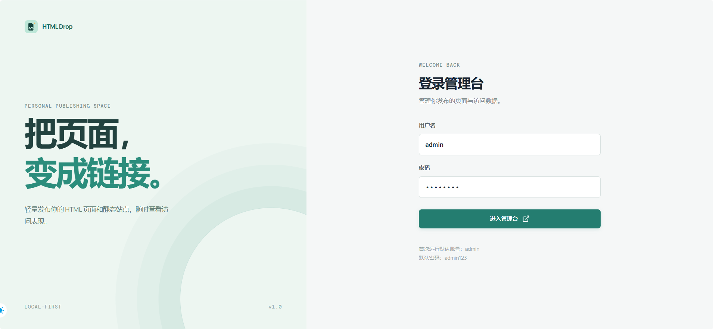
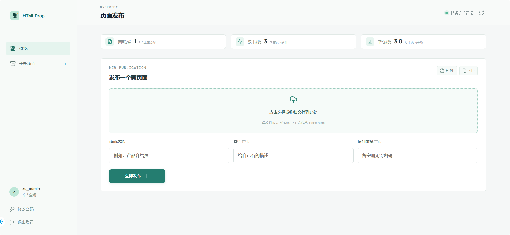
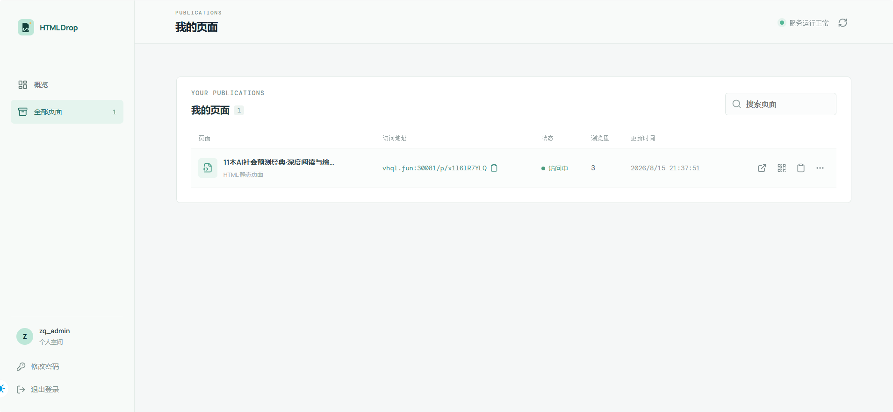
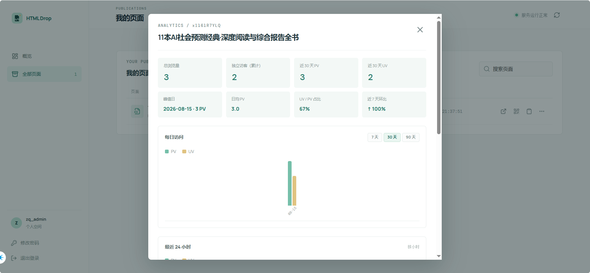

# HTML Drop

> Turn a html into a link.

[中文文档](README.md)

HTML Drop is a personal HTML / ZIP static page publishing service: upload a page, get a link, and optionally add an access password, view traffic statistics, or generate a QR code. Small, practical, and pleasantly uncomplicated.

The project takes inspiration from the lightweight publishing idea behind [Cloudflare Drop](https://drop.cloudflare.com/), and aims to provide a self-hosted, open-source personal Cloudflare Drop.

## Contents

- [Features](#features)
- [Screenshots](#screenshots)
- [Tech Stack](#tech-stack)
- [Quick Start](#quick-start)
- [Configuration](#configuration)
- [Upload Formats](#upload-formats)
- [Project Structure](#project-structure)
- [Management API](#management-api)
- [Testing](#testing)
- [Security Notes](#security-notes)
- [License](#license)

## Features

- Publish `.html` / `.htm` files and `.zip` static sites containing `index.html`
- Upload by file picker or drag and drop, then receive a public link
- Add, edit, or remove an optional access password
- Search, paginate, edit, replace, pause, resume, and delete published pages
- View PV / UV, daily visits, recent 24-hour traffic, browsers, devices, operating systems, and referrers
- Copy links, open pages, view QR codes, and download QR code images
- Store data in SQLite without an additional database service
- Protect ZIP extraction against path traversal, symbolic links, excessive file counts, and oversized archives

## Screenshots

Login page:



Overview and publishing page:



Published page list:



Traffic analytics:



## Tech Stack

| Part       | Technology                         | Package manager |
| ---------- | ---------------------------------- | --------------- |
| Backend    | FastAPI + SQLite + Uvicorn         | uv              |
| Frontend   | React 18 + Vite + TypeScript       | pnpm            |
| Deployment | Docker multi-stage build + Compose | Docker          |

## Quick Start

### Docker deployment (recommended)

Create the local configuration file:

```bash
cp backend/.env.example backend/.env
```

Edit `backend/.env` and, at minimum, change `ADMIN_PASSWORD` and `SESSION_SECRET`. Then build and start the service:

```bash
docker compose up -d --build
docker compose ps
docker compose logs -f html-drop
```

The default URL is `http://YOUR_SERVER_IP:20080`. The health endpoint is `/api/health`.

Stop the service:

```bash
docker compose down
```

You can also use the deployment scripts:

```bash
# Linux / macOS
bash scripts/deploy.sh

# Windows PowerShell
.\scripts\deploy.ps1
```

Compose loads container variables from `backend/.env`. The database and uploaded files are mounted to `/vol1/data/HTMLDrop/` on the host by default. Change the volume paths in `docker-compose.yml` when deploying elsewhere.

### Local development

Backend:

```bash
cd backend
uv venv .venv
uv pip install --python .venv -r requirements.txt
uv run uvicorn app.main:app --host 127.0.0.1 --port 8000
```

In another terminal, start the frontend:

```bash
cd frontend
pnpm install
pnpm run dev
```

Open `http://localhost:5173`. Vite proxies `/api` and `/p` to the backend on port 8000.

When running the backend directly, export the variables from `backend/.env` in your shell first. Docker Compose loads that file automatically.

## Configuration

Copy `backend/.env.example` to `backend/.env`. Do not commit the real `backend/.env`:

| Variable          | Description                                                                                     |
| ----------------- | ----------------------------------------------------------------------------------------------- |
| `ADMIN_USERNAME`  | Administrator username                                                                          |
| `ADMIN_PASSWORD`  | Administrator password; change it in production                                                 |
| `SESSION_SECRET`  | Signing key for sessions and access-password cookies; generate one with `openssl rand -hex 32`  |
| `PUBLIC_BASE_URL` | Full public base URL, for example `https://page.example.com`; request origin is used when empty |
| `TZ`              | Container timezone, `Asia/Shanghai` by default                                                  |

Restart the container after changing the administrator password. You can also change it from the account menu in the lower-left corner of the management console.

## Upload Formats

- `.html` / `.htm`: published as a single-file page.
- `.zip`: published as a static site. The ZIP root must contain `index.html`; a single top-level directory containing `index.html` is also supported.
- Individual uploads are limited to 50 MB.
- ZIP extraction is limited to 100 MB and 500 files, and rejects path traversal and symbolic links.

## Project Structure

```text
.
├── backend/
│   ├── app/              # FastAPI application, database, and services
│   ├── tests/            # Backend tests
│   ├── .env.example      # Configuration template; use backend/.env locally
│   ├── Dockerfile        # Multi-stage frontend build and backend runtime image
│   └── requirements.txt
├── frontend/
│   ├── src/              # React management console and frontend tests
│   ├── package.json
│   └── pnpm-lock.yaml
├── docs/
│   └── images/           # README screenshots
├── scripts/              # Linux and PowerShell deployment scripts
├── docker-compose.yml
├── LICENSE               # GPL-3.0
├── README.md             # Chinese documentation
└── README.en.md          # English documentation
```

Runtime data is kept out of Git: Compose mounts the SQLite database and uploaded files to the host, and `backend/.env` is ignored.

## Management API

Except for public pages under `/p/{slug}`, management endpoints require both the login session and the API token returned by login. The frontend sends the token as `X-API-Token` and `Authorization: Bearer`.

| Endpoint                                  | Description                                       |
| ----------------------------------------- | ------------------------------------------------- |
| `POST /api/auth/login`                    | Log in and return `api_token`                     |
| `GET /api/auth/me`                        | Return the current user and default-password flag |
| `POST /api/auth/password`                 | Change the administrator password                 |
| `POST /api/auth/logout`                   | Log out and invalidate the token                  |
| `GET /api/links`                          | Get a paginated page list                         |
| `GET /api/links/summary`                  | Get page and view-count totals                    |
| `POST /api/links`                         | Publish an HTML / ZIP page                        |
| `PATCH /api/links/{id}`                   | Edit page details or access password              |
| `POST /api/links/{id}/upload`             | Replace the page file                             |
| `POST /api/links/{id}/enable` / `disable` | Resume / pause access                             |
| `DELETE /api/links/{id}`                  | Delete a page and its files                       |
| `GET /api/links/{id}/stats`               | Get traffic statistics                            |
| `GET /api/health`                         | Health check                                      |

## Testing

Backend tests require `pytest`, `pytest-asyncio`, and `httpx`:

```bash
cd backend
uv pip install --python .venv pytest pytest-asyncio httpx
uv run python -m pytest
```

Frontend tests:

```bash
cd frontend
pnpm test
```

## Security Notes

- Never commit the real `backend/.env`, administrator password, or `SESSION_SECRET`.
- The management token is stored in the current browser tab's `sessionStorage`, so a refresh keeps the session while closing the tab clears it.
- Scripts from same-origin public pages could theoretically read `sessionStorage`. If you host untrusted pages, put public pages behind a separate domain and keep the management console on its own origin.
- Change the administrator password and set a random `SESSION_SECRET` before exposing the service publicly.

## License

This project is released under the [GNU General Public License v3.0](LICENSE) (GPL-3.0).

You are free to use, modify, and redistribute it, but derivative versions must comply with the GPL-3.0 requirements and provide the corresponding source code. In short: take it, tinker with it, and please bring your improvements back to the community.
